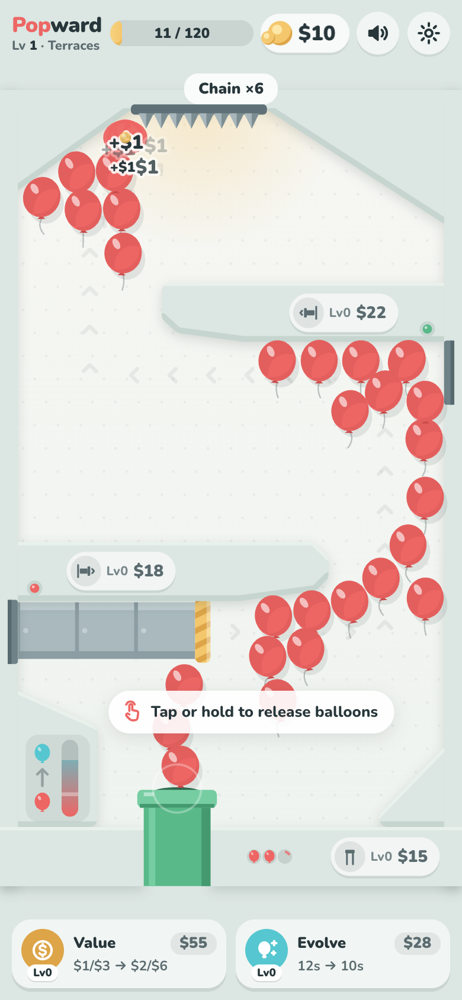
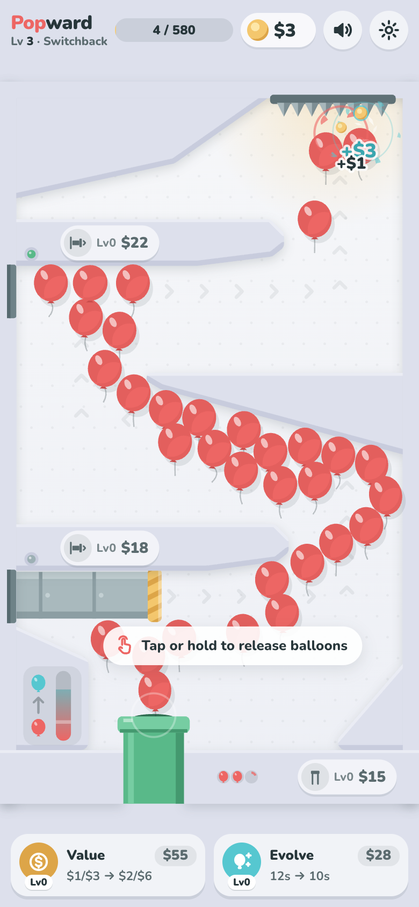
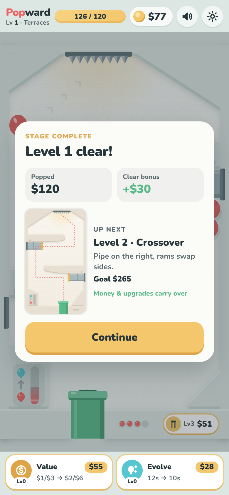

# Popward

**▶ Main sekarang: https://irvanfaturohman.github.io/popward/** (paling enak di HP, mode portrait; di desktop tampil dalam bingkai HP)

<p align="center">
  
  
  
</p>

Prototype game mobile portrait berbasis web: keluarkan balon merah dari pipa, biarkan dua pusher mendorongnya melewati jalur bertingkat, dan pecahkan di duri langit-langit untuk mendapat uang. Uang dipakai untuk upgrade pipa, pusher, nilai balon, dan kecepatan evolusi.

Stack: Vite + TypeScript, Canvas 2D untuk arena, DOM untuk HUD/tray/overlay, Matter.js untuk fisika, Web Audio API untuk semua suara (sintetis, tanpa file audio). Tidak ada backend.

## Menjalankan

```bash
npm install
npm run dev        # buka http://localhost:5173
```

`npm run dev` memakai `--host`, jadi HP Android di Wi-Fi yang sama bisa membuka URL "Network" yang dicetak Vite (mis. `http://192.168.x.x:5173`).

```bash
npm run build      # typecheck + build produksi ke dist/
npm run preview    # sajikan dist/
npm run deploy     # build lalu publish dist/ ke branch gh-pages (GitHub Pages)
```

Parameter URL yang berguna:

| Parameter | Fungsi |
| --- | --- |
| `?debug=1` | Overlay debug: collider, hitbox duri, zona/jalur arena, FPS, jumlah balon, timer evolusi, status pusher. Tombol: `m` +$100, `M` +$5K, `e` isi evolusi, `c` selesaikan stage, `h` sembunyikan panel |
| `?reset=1` | Hapus save sebelum mulai |
| `?test=1&speed=4` | Mengekspos `window.popward` untuk skrip QA; `speed` mempercepat simulasi (hanya di mode test/debug) |

## Cara main

- **Tap** di area kosong arena untuk mengeluarkan satu balon (tidak perlu tepat di pipa). **Tahan** untuk mengeluarkan berulang (interval 0,2 detik) selama charge masih ada. Spasi juga bisa di desktop.
- Charge (titik balon kecil di samping pipa) mulai dari 3 dan pulih bertahap. Tap saat kosong memberi getaran pip + bunyi pendek, bukan popup.
- Setelah 3 detik tanpa input, pipa mengeluarkan balon sendiri tiap ~3,5 detik (tetap patuh batas balon aktif).
- Pusher bawah dan atas bergerak otomatis (istirahat → tarik sedikit → dorong → tahan → mundur). Lampu kecil di atas tiap pusher menunjukkan fasenya.
- Balon yang menyentuh duri pecah: uang dan progress stage bertambah sesuai nilainya. Uang **hanya** diberikan saat pecah.
- Chip harga di dekat pipa dan tiap pusher membeli upgrade alat itu. Tray bawah berisi **Value** dan **Evolve**.

### Bar evolusi (interpretasi mekanik)

- Bar vertikal di kiri bawah arena terisi berdasarkan **waktu simulasi aktif** (12 detik di awal, makin cepat dengan upgrade Evolve). Bar berhenti saat game di-pause, tab tersembunyi, atau kartu stage terbuka.
- Saat penuh, game memilih **balon merah aktif yang paling lama berada di arena** (minimal 0,8 detik, sudah keluar dari pipa). Percikan toska terbang dari bar ke balon itu, lalu warnanya berubah merah → toska dengan cincin, kilau, dan label nilai. Identitas dan fisika balon tetap sama. Bar kembali ke nol saat percikan dilepas.
- Jika tidak ada balon merah, bar menunggu dalam keadaan penuh (berdenyut) dan langsung bekerja begitu ada balon merah.
- Jika balon target keburu pecah sebelum percikan tiba, bar dikembalikan penuh supaya evolusi tidak hilang.
- Balon toska bernilai 3× merah di semua level upgrade (merah `1×(1+L)`, toska `3×(1+L)`). Balon toska juga punya tanda kilau putih agar terbaca tanpa bergantung pada warna.

### Stage

| Level | Layout | Ciri |
| --- | --- | --- |
| 1 | Terraces | Pipa kiri-tengah, pusher bawah dari kiri, shaft kanan, pusher atas dari kanan, duri tengah-kiri |
| 2 | Crossover | Pipa kanan, pusher bertukar sisi, bibir teras miring, lantai bawah berbentuk V, duri tengah-kanan |
| 3 | Switchback | Tiga tingkat; tingkat tengah memakai ramp miring pasif, kedua pusher dari kiri, duri kanan atas |

Level 4+ mengulang ketiga layout dengan target yang terus naik. Saat target tercapai: bonus kecil, konfeti, SFX, lalu kartu dengan pratinjau layout berikutnya dan tombol **Continue**. Uang dan upgrade terbawa; balon stage lama dibersihkan.

## Mengubah angka balance

Semua angka gameplay ada di **`src/balance.ts`**, dengan komentar singkat tentang tradeoff tiap angka.

| Grup | Isi |
| --- | --- |
| `BALLOON` | radius, `buoyancy` (daya apung), `airFriction`, restitution, batas kecepatan, drift |
| `SPAWN` | batas balon aktif (`maxActive`), charge awal, waktu recharge, interval tahan, idle delay, interval auto-spawn |
| `VALUE` | nilai dasar merah/toska |
| `EVOLUTION` | durasi bar, pengali per level, batas minimal, durasi tween |
| `PUSHER` | siklus dasar, pengali per level, travel dasar + per level, `punch` (0 = dorong lembut, 1 = melontarkan), pembagian fase |
| `UPGRADES` | harga dasar, pertumbuhan harga, level maksimal tiap upgrade |
| `STAGE` | target level 1, pertumbuhan target, porsi bonus, durasi selebrasi |
| `RESCUE` / `RECOVERY` | aturan balon macet dan balon yang keluar arena |
| `FX` / `AUDIO` | jumlah partikel, jendela chain, batas suara serempak |

Geometri stage ada di **`src/config/stages.ts`**: dinding berupa poligon convex, posisi pipa, duri, pusher (`side`, `y`, `maxTravel`, `phase`), posisi chip upgrade, zona arah (untuk rescue), dan jalur (untuk debug + chevron). Frame luar, lantai, dan pipa dibuat otomatis oleh `src/config/geometry.ts`. Untuk menambah stage, tambahkan objek `StageConfig` ke array `STAGES`.

### Hasil tuning (terukur, bukan tebakan)

- Angka awal dari brief (3 charge, pulih 1,5 detik, merah $1, target 40–60) membuat stage 1 selesai dalam ~70 detik saat dimainkan aktif. Karena target waktu 2–4 menit lebih penting, **target stage 1 dinaikkan ke $120** (tumbuh 2,2× per level) dan harga upgrade pertama diatur ke $15.
- Bot pacing (`npm run pacing`, tap terus-menerus ~3×/detik, membeli yang termurah dan menabung untuk Value): pembelian pertama di **~26 detik**, stage 1 selesai **~122 detik**, stage 2 dan 3 masing-masing ~2–2,5 menit, dengan pembelian tiap 15–20 detik. Pemain manusia biasanya sedikit lebih lambat dari bot, jadi perkiraannya pembelian pertama ~30–40 detik dan stage 1 ~2,5–3 menit.

## Catatan fisika

- **Fixed timestep 60 Hz** dengan accumulator, maksimal 5 langkah catch-up per frame. Tiap langkah dibagi menjadi **2 substep** (8,3 ms) agar ram yang cepat tidak menembus tumpukan balon. Render memakai `requestAnimationFrame` dengan interpolasi posisi. Saat tab tersembunyi, simulasi berhenti dan clock di-reset saat kembali (tidak ada loncatan).
- Gravitasi Matter dimatikan. Tiap balon diberi gaya apung dan drift horizontal sendiri. Collider balon berupa lingkaran (16 sisi, tanpa rotasi). Oval, ikat, tali, goyangan, dan squash hanya visual.
- **Pusher kinematik:** ram adalah body statis Matter yang dipindahkan tiap substep dengan `Body.setPosition(body, pos, updateVelocity = true)`. Dengan begitu solver menganggapnya bermassa tak hingga dengan kecepatan nyata: overlap diselesaikan dengan menggeser balon saja, dan kecepatan ram diteruskan lewat kontak. Collider mencakup seluruh blok ram (bukan hanya pelat depan), jadi tidak ada celah di belakang ram. Travel tiap stage dibatasi agar muka ram selalu berjarak >3 lebar balon dari dinding seberang (tidak ada crush). Perubahan travel dari upgrade baru diterapkan saat ram istirahat supaya ram tidak pernah teleport.
- **Friksi 0** di semua permukaan. Matter melakukan warm-start friksi di setiap iterasi solver, sehingga friksi kecil pun (0,02) berperilaku seperti lem pada kecepatan geser rendah dan balon berhenti di langit-langit miring. Hal ini ditemukan saat pengujian, lalu diperbaiki.
- Bagian bawah teras yang tidak terjangkau ram dibuat sedikit miring ke arah bukaan, supaya tidak ada titik mati permanen.
- **Rescue:** balon yang hampir tidak bergerak selama 5 detik, atau tertahan di satu zona jalur selama 15 detik, diberi satu dorongan kecil yang terlihat (dengan asap) searah jalur. Ada cooldown per balon, batas 6 per balon, dan cooldown global. Balon tidak pernah dipecahkan atau dipindahkan ke duri.
- **Recovery:** balon yang keluar dunia atau pusatnya berada di dalam dinding lebih dari 1 detik dikembalikan ke pipa, tanpa reward. Frame pengaman tak terlihat di luar arena mencegah balon hilang. Selama pengujian stress, jumlah recovery = 0.
- Batas **34 balon aktif**. Batas ini juga membuat kecepatan pusher berdampak ekonomi di akhir game: dengan pipa maksimal dan ram lambat, arena penuh dan spawn tertahan ("Arena full — upgrade pushers").

## Pengujian yang dijalankan

Skrip QA memakai Playwright dengan Google Chrome yang sudah terpasang (`channel: 'chrome'`). Tanpa Chrome, jalankan `npx playwright install chromium` lalu set `PW_CHANNEL=bundled`. Semua skrip membutuhkan dev server yang sedang berjalan.

| Skrip | Isi |
| --- | --- |
| `npm run qa` | 51 pemeriksaan end-to-end: tap/tahan/charge/pemulihan, tap UI tidak spawn, idle spawn, pop dibayar tepat sekali dan progress = nilai, evolusi memilih merah tertua, bar reset, bar menunggu tanpa merah, toska membayar lebih, kelima upgrade (harga tepat, level/harga naik, efek langsung, tidak bisa minus), stage clear → kartu → Continue → layout 2, uang/upgrade terbawa, reload memulihkan save, mute tersimpan, save rusak → mulai bersih, stage 3 berjalan, pause saat tab tersembunyi tanpa loncatan waktu, batas balon aktif, settings pause + reset dengan konfirmasi, resize, tanpa error console |
| `npm run pacing` | Bot pacing (lihat hasil di atas) |
| `npm run stress` | Pipa dan pusher maksimal dengan CPU throttling 4×: stabil 60 fps (p95 16,8 ms) dengan 24–32 balon, tanpa NaN, tanpa balon keluar arena |
| `node scripts/throughput.mjs` | Pops/detik terhadap level pusher |
| `node scripts/shot.mjs <url> <out.png> <w> <h>` | Screenshot cepat |

Viewport yang sudah dicek lewat screenshot: 360×780, 390×844, 430×932 (mobile, DPR 2) dan desktop 1280×800 (bingkai portrait + petunjuk kontrol).

## Arsitektur

```
src/
  main.ts                 bootstrap, input, resize, lifecycle, loop rAF
  balance.ts              semua angka gameplay
  config/stages.ts        data geometri 3 stage
  config/geometry.ts      frame/lantai/pipa yang dibuat otomatis
  game/Game.ts            fixed-step loop, spawn, evolusi, pop, alur stage, rescue/recovery, save
  game/GameState.ts       satu sumber kebenaran + save versioned + settings
  game/Economy.ts         uang, progress, target, bonus
  game/UpgradeSystem.ts   harga, pembelian, efek tiap level
  game/Feedback.ts        event → partikel, suara, haptic, flourish UI
  game/events.ts          tipe event (spawn, evolve, pop, purchase, stageComplete, …)
  physics/PhysicsWorld.ts wrapper Matter.js, helper kecepatan
  entities/Balloon.ts     body + state visual balon
  entities/Pusher.ts      siklus ram kinematik
  render/Renderer.ts      kamera, layer statis ter-cache, gambar arena
  render/Particles.ts     partikel + teks mengambang
  audio/Audio.ts          SFX sintetis Web Audio
  ui/UI.ts                HUD, chip, tray, overlay, toast, koin terbang
  debug/DebugOverlay.ts   overlay ?debug=1
```

State (uang, progress, level, upgrade, charge, bar evolusi) hanya ditulis oleh Game/Economy/UpgradeSystem. UI, audio, dan FX membaca state atau mendengarkan event bus. Save ditulis tiap ~3 detik saat ada perubahan, serta langsung pada pembelian, stage clear, Continue, reset, tab tersembunyi, dan `pagehide`. Settings (mute/volume/reduced motion) disimpan terpisah, jadi Reset Progress tidak mengubahnya.

## Aksesibilitas & feel

- `prefers-reduced-motion` dihormati (bisa di-override di Settings: Auto/On/Off): shake mati, partikel dikurangi, goyangan/bobbing UI mati. Informasi penting tetap tampil.
- Suara dibuat setelah interaksi pertama (kebijakan autoplay), dibatasi per jenis dengan cooldown dan maksimal 4 pop per 100 ms. Pitch pop naik sedikit saat chain (murni kosmetik, tanpa multiplier tersembunyi). Default volume 65%.
- Getaran ringan (`navigator.vibrate`) hanya untuk evolusi, pembelian, dan stage clear, dan hanya saat suara menyala.
- Safe area (notch/home bar), tanpa scroll/pinch-zoom/seleksi teks, canvas mengikuti devicePixelRatio (maks 2) tanpa memengaruhi fisika.

## TODO / ide berikutnya

- Mekanik baru yang sengaja belum dibuat: kipas, gergaji, magnet, balon spesial.
- Tuning pusher lebih lanjut: saat ini pusher terutama mengurangi waktu tunggu dan kepadatan; efek ekonominya baru terasa saat arena mendekati batas balon.
- Uji di perangkat Android fisik (target performa sejauh ini diverifikasi dengan throttling CPU di Chrome desktop).
- Offline earnings / statistik per sesi, dan ikon PWA + manifest.
